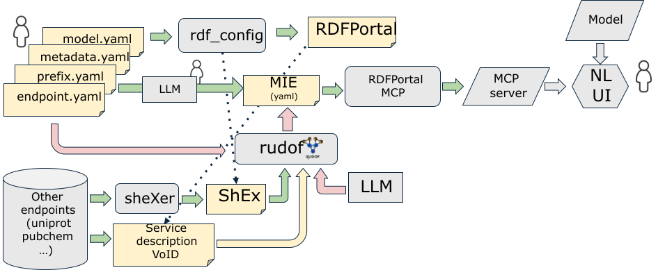

# Introduction

The Model Context Protocol (MCP) [@citesForInformation:mcp_anthropic] establishes an interface between Large Language Models (LLMs) and external utilities. 
MCP servers allow developers to expose specialized tools through a uniform schema enhancing interoperability accross different systems transforming the integration from a many-to-many dependency graph to a uniform interface.
It can increase the usability of LLMs which can interact directly with structured knowledge bases,
reducing the overhead required to bridge probabilistic reasoning with deterministic tools.
One possible application of MCP servers is to offer access to RDF data portals which expose SPARQL endpoints, like the RDF Portal developed by the Database Center for Life Science in Japan: https://rdfportal.org/.
MCP Servers can offer a natural language interface which is complemented with a deterministic SPARQL-based query engine. 
While RDF and SPARQL provide a highly expressive knowledge representation, the flexibility of their schema-agnostic approach can result in structural opacity, 
hindering reliable automated consumption.
Shape Expressions (ShEx) have been proposed as a formal schema language that can describe the required graph topology of an RDF data portal. There are several tools that implement ShEx validators like `rudof`, a general tool that implements different types of RDF data models and shapes technologies [@citesForInformation:rudof].

In this paper, we present a report of the project that we developed as part of our participation in the [DBCLS BioHackathon 2025](https://2025.biohackathon.org/), which was focused on the exploration of using MCP servers for RDF data portals and SPARQL endpoints combined with Shape Expressions.
During the project, we also identified other challenges like the comparison between different Shape Expressions that can be extracted from existing SPARQL endpoints or the analysis of the evolution of ontologies using their shapes. 

During the project, we identified three main contributions:

- RDF Portal MCP server (TogoMCP): The RDFPortal MCP server ("TogoMCP" for short) connects an LLM (we used Claude Sonnet 4 in BH25) to the RDFPortal SPARQL endpoints. Given natural language queries, the LLM translates them into SPARQL queries. TogoMCP sends those SPARQL queries to the RDF Portal and the obtained query results are sent back to the LLM for further interactions. Before BH25, TogoMCP has already incorporated several databases provided at the RDF Portal, such as UniProt, PDB, ChEMBL, PubChem, to name a few.

- MIE specification. To make SPARQL generation more accurate and effective, TogoMCP utilizes a special file, called a MIE file, for each database. 
The MIE file for a database contains the metadata, a biologically relevant subset of ShEx and VoID schemas, as well as examples of RDF subgraphs and SPARQL queries, all concisely annotated in natural language (English). When a user provides a prompt that requires SPARQL queries, the LLM will (usually) calls an MCP tool named **describe_rdf_schema** with the database name as the argument, which presents the MIE file to the LLM. The MIE files are semi-automatically generated using the LLM and a hand-crafted template MIE file. An MCP prompt with a database name argument is also a part of TogoMCP. When BH25 started, there was no specification for the MIE file. The structure of the MIE template was ad hoc, and we didn't know which parts of the MIE file was critical. Thus, the objectives of working team included finding out the features essential for accurate and effective SPARQL generations and explicitly specifying them in the template file.

- `rudof` MCP Server and other extensions: Motivated by our work during the biohackathon, we implemented an MCP server wrapper for rudof functionality. Although it is currently under development, it already supports some relavant features like validation and SPARQL querying, as well as basic support for MIE format and `rdf_config` files. During the biohackathon, we also identified some interesting extensions for rudof, like the possibility to compare ShEx schemas to check the real differences between various incarnations of similar data in different RDF data portals as well as the evolution of ontologies.

In the following sections, we provide a description of the activities that were developed before the Biohackatho as well as the actitivies that were done during participation the Biohackathon and also some activities that we carried on after the biohackathon and that we are planning to work in the future. 

# Report of activities

## Before the biohackathon

Before the biohackathon, we had some offline interaction to identify a common project that we were interested to work on. We considered that it would be interesting to leverage LLMs to increase the usability of RDF portals and that maybe the use of MCP servers could offer some interesting possibilities. In that sense, we did some initial work on implementing an MCP server for RDF portal which was available in this github repository: https://github.com/arkinjo/RDFPortal-MCP and we also created an initial version of an MCP server for rudof: https://github.com/rudof-project/rudof. In this way, we could have some initial setup for collaboration during the Biohackathon.

## Day 1

### Architecture and MIE files

During the first and second day of the biohackathon we had some discussions where we could identify the main architecture and possible pipeline for the tools which is presented in the following figure.



The main building blocks are:

- RDF-Config is the tool employed in RDF Portal to configure the different RDF datasets published. It contains a set of configuration files in YAML formal described [here](https://github.com/dbcls/rdf-config/blob/master/doc/spec.md). Those config files are manually curated by domain experts. 
- RDFPortal MCP Server is the intended MCP Server. We departed from the previous work done in [RDFPortal MCP](https://github.com/arkinjo/RDFPortal-MCP).
- MIE files: We identified the need for a simplified specification file for the MCP server which we named MIE files. The first MIE files were generated by combining a manual process with an LLM based one but we considered that it would be better if we could generate them automatically. To that end, we explored different paths.
- [rudof](https://rudof-project.github.io/) is a tool that has support for Shape Expressions and we intend to automatically generate the MIE files using rudof in the future. 
- [sheXer](https://github.com/weso/shexer) is a tool that can be used to extract Shape Expressions from existing RDF data. The goal is that we could explore the possibility of automatically generating MIE files without human intervention, or maybe with some LLM suppport (hence the LLM box in the figure). 
- Given that some RDF data portals publish service descriptions following the [SPARQL service description vocabulary](https://www.w3.org/TR/sparql11-service-description/) and the [VoID vocabulary](https://www.w3.org/TR/void/). We have also extended rudof to support service descriptions which can be exported as Shape Expressions, which can offer a ShEx schema which follows what the service provider intends. This view can be complementary to the view offered by sheXer, which is based on the real contents of the RDF dataset.
- The Natural Language User Interface (NL UI) building block will be part of the different models that can be plugged into the MCP server. During the biohackathon we mainly explored the use of Claude, but in principle, any model that supports MCP could be used for the evaluation.

The MIE files are presented (on demand) to the LLM to help it understand the RDF schema of the databases, which in turn enables the construction of accurate and effective SPARQL queries.

An initial MIE file template was developed here: https://github.com/arkinjo/RDFPortal-MCP/blob/BH25/resources/MIE_template.yaml

That MIE template was ad hoc, and could be inconsistent, and/or may contain too little or too much information. 
As another example, the UniProt MIE file was: https://github.com/arkinjo/RDFPortal-MCP/blob/main/mie/uniprot.yaml and there are other MIE files in [this folder](https://github.com/arkinjo/RDFPortal-MCP/tree/main/mie)

### TogoMCP

We added Glycosmos, along with a configuration file that would later become a MIE file, to TogoMCP.
Unlike other databases, the Glycosmos interface uses its original SPARQL endpoint (https://ts.glycosmos.org/sparql) rather than the one provided by the RDF Portal so it has access to the latest version of Glycosmos. The process of creating the Glycosmos MIE file is provided at https://claude.ai/share/6ed633b7-24c6-4843-98c9-eb4506c5c156. The resulting MIE file is uploaded to the GitHub: https://github.com/arkinjo/RDFPortal-MCP/blob/BH25/mie/glycosmos.yaml. We tested Glycosmos with a few biological questions:

- [Glycan Biosynthesis Pathway Evolution](https://claude.ai/share/3dfcd4d2-205a-493d-9a6a-e9edf3df6860)
- [Glycosylation-Related Genes in Cancer](https://claude.ai/share/4a9b2cdc-edc4-429c-9b8e-29681e747247)

Members from another working group (Glycosmos MCP server) confirmed that the results were reasonable.

### Schema comparison

A related project that appeared during the biohackathon and we considerec quite interesting is the possibility to compare ShEx schemas that intend to represent the same class of entities in different RDF data portals. To that end, we started a prototype implementation of a ShEx comparator tool in collaboration with a related project from Javier Millán Acosta.

One aspect to take into account is the differences in prefix declarations from one SPARQL endpoint to another. For example, the following table compares the [different prefix declarations](https://docs.google.com/spreadsheets/d/1ciddrqV1CNnNdCBkLt-By_aROMCBJrGd7IEj3rNnojE/edit?gid=630722908#gid=630722908). 

### Next steps identified in day 1

The main obstacle to using ShEx and VoID (and RDF-config) as prompts to the LLM is that they are often too big (i.e., consume too many tokens).
The MIE file is designed to provide a more concise and compact representation of the essential information of ShEx and VoID, with a particular focus on constructing correct and effective SPARQL queries. We identified the following steps to continue working during the Biohackathon:

- Parse/read VOID-Service description files. `rudof` already supports Service descriptions which could be used to obtain a service description that follows the intent of the SPARQL endpoint provider.
- Parse/read rdf-config files. Although [rdf-config](https://github.com/dbcls/rdf-config/) is already established and contains all the necessary functionality for the RDF portal, we wanted to explore the possibility to read and integrate the config files from rudof. So considered that it would be interesting to add support for rdf-config inside rudof.
- Parse/read ShEx. This is already supported by rudof.
- Unify and obtain a simplified version and generate MIE files. We added [a module](https://github.com/rudof-project/rudof/tree/master/mie) for MIE in rudof.
- We considered that we could start by selecting a use case to compare ShEx schemas and continue working on it in collaboration with Javier Millán Acosta.

## Day 2

### TogoMCP/MIE file

One of the crucial ingredients of the MIE file is the ShEx-like schema, which contains a biologically relevant subset of the ShEx (shape expressions). Currently, this subset is more or less randomly determined by the LLM during its exploration of the RDF graphs. As a results, it is highly possible that important classes and properties are missing in the resulting MIE file, which in turn deteriorates the quality of LLM-generated answers to biological queries. To avoid this problem, we considered the use of RDF-Config. RDF-Config can generate a SheX schema from a set of hand-crafted RDF-config (YAML) files. As such, we can explicitly specify a biologically relevant subset of the ShEx schema. We may use this feature of RDF-Config to craft a better prompt for creating the MIE file. However, making the RDF-config files can be a tedious task. Thus, we tried to use an LLM to help this process by creating a prompt for the LLM that contains a template of the RDF-Config YAML files. 

- The RDF-Config template (tentative): https://github.com/arkinjo/RDFPortal-MCP/blob/BH25/rdf-config/template.yaml
- Generating the Glycosmos RDF-Config using Claude: https://claude.ai/share/2f903a1c-eb12-479e-ad22-96b9ca13be90

The resulting RDF-confing file looks promising. However, we found that the LLM sometimes gave outputs that deviated from the specification of the RDF-Config file.
Further experimentation is necessary to produce strictly well-formed RDF-Config files.

### MIE data model in Rust

We created a [MIE data model](https://github.com/rudof-project/rudof/blob/master/mie/src/mie.rs) in Rust for rudof, so we could have a first implementation to generate MIE files from ShEx.

## Day 3

### TogoMCP/MIE file

Upon the request from the Microbial Knowledge Bases group, we integrated [BacDive](https://bacdive.dsmz.de/) and [MediaDive](https://mediadive.dsmz.de/) into TogoMCP. 
As they had manually curated RDF-Config files, we could also have used the biologically relevant subsets of the ShEx schemas of these databases, but this was not done at this time (it was eventually done on Day 5). In addition, they prepared a list of biological questions:

#### BacDive Questions
- Show me the type strain of Belnapia moabensis.
- Which strains belong to the order Rhizobiales?
- Does strain DSM 16746 form spores?
- What is the cell shape and Gram stain of Escherichia coli?
- Which strains are motile and aerobic?
- List bacteria that produce orange pigments.
- What temperature and pH ranges support growth of Saccharolobus solfataricus?
- Which strains grow at 30 °C but not at 15 °C?
- What is the GC content of Corynebacterium glutamicum?
- Give me the 16S rRNA accession number for DSM 16746.
- Which strains have genome assemblies in PATRIC?
- What is the biosafety level of DSM 639?
- Which strains are pathogenic to humans?
- Are there strains that are susceptible to penicillin but resistant to ampicillin?
- List strains that can degrade toluene.
- Which strains from the family Flavobacteriaceae are moving by gliding and have alpha hemolytic activity?
- Which strains isolated from soil produce endospores?
- Show me the strains from a marine environment and their mean optimal temperature and pH.
- Show me all strains isolated from the host "Zea mays" and their pathogeneticity against plants.
- Regarding enzyme activity, which strains have alcohol dehydrogenase activity and grow at high temperature?
- Which strains can utilize both, glucose and nitrate?We used these questions to create the MIE files. That is, we instructed the LLM to explore the RDF graph structure deeply enough to be able to answer these questions. 

#### MediaDive Questions
- What is the composition of DSMZ Medium 119?
- Which ingredients are used in MRS Medium?
- Does Medium 119 contain KH2PO4?
- Which equipment is required for preparing Medium 119?
- Give me the CAS number and synonyms for KH2PO4.
- Which medium ingredients are frequently optional?
- What is the pH and temperature for cultivating strains from Lactobacillus in MRS Medium?

#### Combined BacDive and MediaDive Questions
- Which strains are known to produce lactic acid and grow in MRS Medium?
- List strains that can be cultivated in Medium 1 and are motile.
- Which pathogenic strains can be grown using glucose as a carbon source?

We can include these questions in the prompts to create the MIE files so that the LLM explore the RDF graphs as deeply as necessary to answer these questions. We then tried a few queries: 
- https://claude.ai/share/17692599-c73a-49ad-b53f-cbdcf3aee3a6
- https://claude.ai/share/94400107-b8bb-49fa-adfa-dff7bbc2d947

The Microbial KB group examined these results and confirmed that they were reasonable, although not perfect.

### Schema comparison

We realized that the service descriptions developed by uniprot and DBCLS describe the data in opposite ways, in uniprot, they present the data by class while in DBCLS they present the data by property. 

The service descriptions employed in DBCLS can be obtained running the following SPARQL CONSTRUCT query on the SPARQL endpoint: https://plod.dbcls.jp/sparql

```sparql
PREFIX void: <http://rdfs.org/ns/void#>
PREFIX sd: <http://www.w3.org/ns/sparql-service-description#>
PREFIX rdfs: <http://www.w3.org/2000/01/rdf-schema#>

CONSTRUCT WHERE {
  [
    a sd:Service ;
    sd:defaultDataset [
       a sd:Dataset ;
       sd:namedGraph [
         sd:name <http://sparql.uniprot.org/uniprot> ;
         a sd:NamedGraph ;
         sd:endpoint ?ep_url ;
         sd:graph [
           a void:Dataset ;
           void:triples ?total_count ;
           void:classes ?class_count ;
           void:properties ?property_count ;
           void:distinctObjects ?uniq_object_count ;
           void:distinctSubjects ?uniq_subject_count ;
           void:classPartition [
             void:class ?class_name ;
             void:entities ?class_triple_count
           ] ;
           void:propertyPartition [
             void:property ?property_name ;
             void:triples ?property_triple_count
           ]
         ]
       ]
     ]
  ] .
}
```

## Day 4 

### TogoMCP/MIE file

#### The MIE file specification

We discussed on the specification of the MIE file and agreed that the main contents should include the following items:
- schema_info (Metadata on the RDF graphs)
- prefixes (prefixes used in the graphs; This might be unnecessary once the shape_expressions section is replaced with pure ShEx)
- shape_expressions (This may be replaced with the plain vanilla ShEx format?)
- RDF examples (concrete examples of common RDF graph patterns)
- SPARQL examples (This section should include natural language questions and corresponding SPARQL queries)
- cross-reference SPARQL examples (cross-references are particularly important for connecting databases, so we prepare an independent section.)
- data_statistics (statistics useful for optimizing SPARQL queries)

#### Feeding the raw ShEx into the LLM

BacDive and MediaDive come with the ShEx files generated from manually curated RDF-Config files. We attempted to feed the ShEx files directly into the LLM to see the significance of this information. Here are the results of example queries with or without ShEx:
- With ShEx: https://claude.ai/share/9f270856-ab09-4147-a970-e176742f1e06
- Without ShEx: https://claude.ai/share/a86cfbfc-cc38-4e3d-8746-74306ebea632 

We confirmed that the use of ShEx significantly improved the results.

### rudof extensions

Some of the work related to rudof during this day was:

- A bug was found in rudof when parsing ShEx files generated from rdf_config that contained BNode instead of BNODE. The bug was solved and we were able to parse ShEx files generated from rdf_config.
- We created a first version of a ShEx comparator tool in rudof. 
- We added a Jupyter Colab section that explains how it is possible to use rudof to compare schemas: https://rudof-project.github.io/tutorials/compare.html 

## Day 5

### TogoMCP/MIE file

We updated all the MIE files for TogoMCP to confirm the specification decided on the previous day. In particular, the MIE files for BacDive and MediaDive, the RDF-Config-generated ShEx and biological questions were also given to the LLM so that the resulting MIE files incorporated all the ShEx components and the LLM can answer the given questions. We found that creating the MIE files with ShEx and biological questions can take much longer time and some additional prompts, and the resulting MIE files had larger sizes. For example, BacDive's MIE file now has more than 2,000 lines, which may be a little too large than intended. This is partly because the MIE file contained all the given biological questions and corresponding SPARQL queries, in addition to the other SPARQL query examples required by the specification. We then tested the LLM with a few questions. Here are a few examples:

- Composition of a medium: https://claude.ai/share/45982d86-1448-4e8d-8983-7d18610f00e7
- CO2 containing media with inorganic compounds: https://claude.ai/share/f57ef84e-8d8d-4074-8acd-18cda078b224

For the latter question, the Microbial KG group found two media that were previously unknown as containing CO2 and free of organic compounds.

### Rudof extensions

We implemented the first prototype of rudof that gets information from service descriptions and generates a MIE file template. We used it to generate an example MIE file for UniProt and created a Jupyter Colab book that showcases it here: https://rudof-project.github.io/tutorials/service_description.html. When we tried it with RDFPortal, we noticed that the information generated in Turtle in RDFPortal is minimal. One possibility we explored is to use SPARQL CONSTRUCT queries. As rudof also supports SPARQL queries, we may have a way to obtain richer information from RDFPortal. We added a section in the Jupyter book explaining that process. 
The conversion from service descriptions to MIE was very basic, only the name of the SPARQL endpoint. During those days, we went from release versions of [0.1.93](https://github.com/rudof-project/rudof/releases/tag/v0.1.93) to [0.1.102](https://github.com/rudof-project/rudof/releases/tag/v0.1.102).


## After the Biohackathon

After the biohackathon we continued with some activities:

- We continued the development of the TogoMCP server.
- We continued the implementation of more tools and features for the rudof MCP server. It currently supports doing SPARQL queries, obtaining information from nodes in RDF graphs as well as ShEx and SHACL validation.


# Accomplishments and challenges identified

The main accomplishments that we consider are:

- Extended TogoMCP to include Glycosmos, BacDive, and MediaDive.
- We have discovered the importance of biologically relevant questions for better in-context learning of the LLM.
- We have confirmed the power of biologically relevant subset of ShEx schemas for high-quality SPARQL generation.
- We have been able to explore the creation of MCP servers for RDF data portals and tools.

One of the challenges that we have identified during the Biohackathon is to create an evaluation pipeline that can be used to check the increase in usability of an LLM-based interface with MCP server support. For that, we are planning to identify some key competency questions and to setup some experiment that can be used for this evaluation.

# Conclusions

We consider that the combination of MCP Servers and LLMs with RDF Data portals and SPARQL endpoints can increase the usability of existing systems without precluding the accuracy of the answers. In order to do that, leveraging on Shape Expressions as a machine-readable contract, an MCP server can translate natural language requests from the LLM into syntactically and semantically validated SPARQL queries, transforming a black-box data source into an introspectable, usable tool for agentic systems.
We are planning to continue working on this line and to explore how we can evaluate the benefits of this approach in future work. 

# Acknowledgments

We want to acknowledge the organizers of the Biohackathon 2025 for supporting our participation in Mie, Japan. The event generates a unique atmosphere for collaboration between international and local researchers which generate fruitful discussions and projects. Members of the WESO team were partially funded by project SEK-25-GRU-GIC-24-089. 

# Author Contribution

workflow creation, JELG, YY, AK; validation, JELG, YY, AK; critical comments, JMA, YO, SK, JK, DFA and SBL; writing, AK, JELG, YY; implementation: AK, YY, JELG, SBL
